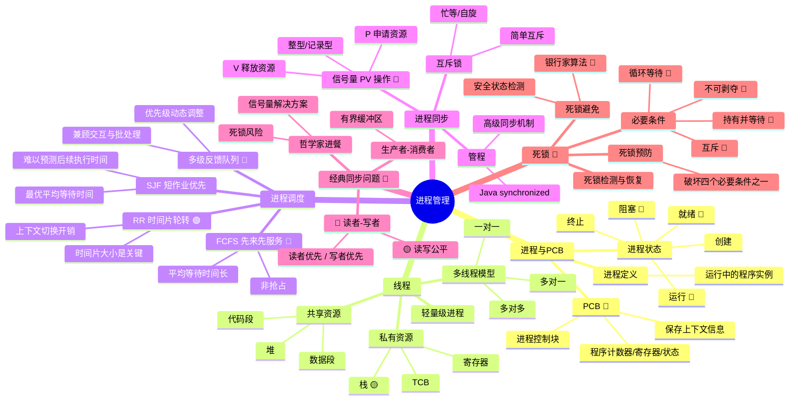

# 操作系统之进程管理 — 知识复盘

## 思维导图



> **导图使用建议**: 从右下角的"死锁"部分开始看，这是 408 考研的高频大题考点。建议先掌握进程与 PCB 的基础概念，然后沿调度 -> 同步 -> 死锁的路径逐步深入。带 🔴 标记的是最高频考点。

---

## 结构化笔记

### 1. 进程与 PCB

#### 1.1 进程的概念

- **一句话解释**: 进程是程序的一次动态执行过程，是操作系统进行资源分配和调度的基本单位。
- **为什么重要**: 操作系统通过进程来隔离不同程序，实现并发执行，是现代操作系统的核心抽象。
- **易错点**: 进程与程序的区别 — 程序是静态的代码集合（存在磁盘上），进程是动态的执行实体（在内存中运行）。一个程序可以对应多个进程。

#### 1.2 进程的三种基本状态

| 状态 | 说明 | 典型转移 |
|------|------|----------|
| 就绪 (Ready) | 进程已获得除 CPU 之外的所有资源，等待 CPU 调度 | 调度程序分配 CPU -> 运行 |
| 运行 (Running) | 进程正在 CPU 上执行 | 时间片用完 -> 就绪；等待 I/O -> 阻塞 |
| 阻塞 (Blocked/Waiting) | 进程因等待某事件（如 I/O 完成）而暂停执行 | 事件发生 -> 就绪 |

- **易错点**: 阻塞态不能直接回到运行态，必须先转为就绪态等待调度。很多初学者会忽略这一中间步骤。
- **考点提示**: 状态的转换条件及其对应的系统调用（如 `wait()` 导致阻塞，`wakeup()` 唤醒至就绪）。

#### 1.3 PCB (进程控制块)

- **一句话解释**: PCB 是操作系统中用于描述和管理进程的数据结构，是进程存在的唯一标识。
- **关键内容**:
  - 进程标识符 PID
  - 程序计数器 PC（下一条指令地址）
  - CPU 寄存器（上下文信息）
  - 内存分配信息
  - I/O 状态信息
  - 文件描述符表
- **考点提示**: 中断/系统调用时的上下文切换，本质上就是保存当前进程的 PCB、恢复目标进程的 PCB。

#### 1.4 进程的创建与终止

- **创建**: `fork()` 创建子进程，`exec()` 加载新程序
- **终止**: `exit()` 正常结束，或收到信号强制终止。子进程终止后父进程需 `wait()` 回收，否则产生僵尸进程。
- **易错点**: 孤儿进程（父进程先于子进程结束）和僵尸进程（子进程结束但父进程未回收）的区别。

---

### 2. 线程

- **一句话解释**: 线程是 CPU 调度的基本单位，是进程内部的一条执行流，同一个进程的多个线程共享进程的资源。
- **为什么重要**: 线程的引入减少了上下文切换的开销，提高了系统并发度。
- **线程 vs 进程**:

| 对比项 | 进程 | 线程 |
|--------|------|------|
| 资源拥有 | 独立地址空间 | 共享所属进程的资源 |
| 切换开销 | 大（切换地址空间、刷新 TLB） | 小（仅切换栈和寄存器） |
| 通信方式 | IPC（管道、消息队列、共享内存） | 直接读写共享变量 |
| 健壮性 | 一个进程崩溃不影响其他进程 | 一个线程崩溃可能拖垮整个进程 |

- **共享资源**: 代码段、数据段、堆、打开的文件、信号处理函数
- **私有资源**: 线程栈（局部变量）、寄存器、程序计数器、线程控制块 TCB
- **易错点**: 同一个进程的线程共享堆但各有独立的栈。很多人混淆堆和栈的共享关系。
- **关联知识点**: 内核级线程 vs 用户级线程 — 用户级线程对内核透明，切换在用户态完成，效率高但无法利用多核。

---

### 3. 进程调度算法

#### 3.1 先来先服务 (FCFS)

- **核心思想**: 按照进程到达 CPU 就绪队列的顺序依次执行。
- **特点**: 非抢占式，实现简单，但平均等待时间较长。
- **适用场景**: 批处理系统，对长作业有利。
- **考点提示**: 计算平均周转时间和平均等待时间，常与 SJF 对比。**护航效应** — 短作业被排在长作业后面，等待时间显著增长。

#### 3.2 短作业优先 (SJF)

- **核心思想**: 选择预计执行时间最短的进程优先执行。
- **特点**: 平均等待时间理论上最优（最小化），但难以准确预测进程未来的执行时间。
- **变体**: 抢占式 SJF 又称最短剩余时间优先 (SRTF)。
- **易错点**: "短作业优先"中的"短"是**预估**的执行时间，而非实际时间。实际系统中难以知道进程还需要运行多久，通常用历史数据的指数平均来预测。

#### 3.3 时间片轮转 (RR)

- **核心思想**: 将 CPU 时间划分为固定长度的时间片，按就绪队列循环分配。
- **关键参数**: 时间片大小的选择至关重要。
  - 时间片过大 -> 退化为 FCFS
  - 时间片过小 -> 上下文切换开销过大
- **适用场景**: 分时系统、交互式系统。
- **计算题**: 给定时间片大小和进程到达时间，计算周转时间、响应时间。

#### 3.4 多级反馈队列

- **核心思想**: 设置多个不同优先级的就绪队列，每个队列内部使用不同的调度算法（通常高优先级用 RR，低优先级用 FCFS），进程可在队列间升降级。
- **特点**:
  - 兼顾交互型（前台）和计算型（后台）进程
  - I/O 密集型进程自动获得高优先级（因经常阻塞等待）
  - CPU 密集型进程自动降级，获得更长时间片
- **考点提示**: 多级反馈队列是 408 高频考点，需掌握队列间的调度规则（如高优先级队列非空时优先服务高优先级）。

---

### 4. 进程同步

#### 4.1 基本概念

- **临界资源**: 一次只允许一个进程访问的资源（如打印机、共享变量）。
- **临界区**: 访问临界资源的代码段。
- **同步原则**:
  - **空闲让进**: 无进程在临界区时，应允许一个进程进入
  - **忙则等待**: 已有进程在临界区时，其他进程必须等待
  - **有限等待**: 等待的进程不能无限期等待
  - **让权等待**: 等待时应释放 CPU（避免忙等）

#### 4.2 互斥锁

- **一句话解释**: 最简单的同步机制，通过加锁和解锁保证临界区互斥访问。
- **分类**:
  - 自旋锁（spinlock）：忙等，适用于临界区极短的场景
  - 睡眠锁：阻塞等待，释放 CPU，适用于临界区较长的场景
- **易错点**: 互斥锁只能解决互斥问题，不能解决同步（顺序执行）问题。

#### 4.3 信号量 — PV 操作 🔴

- **一句话解释**: 信号量是一个整型变量，P 操作请求资源（减 1），V 操作释放资源（加 1），通过信号量的值控制进程的同步与互斥。
- **分类**:
  - 整型信号量: 不满足"让权等待"原则（忙等）
  - 记录型信号量: 增加等待队列，阻塞 -> 就绪，满足让权等待
- **P 操作 (wait/proberen)**:
  - S--; if (S < 0) 进程进入阻塞队列
- **V 操作 (signal/verhogen)**:
  - S++; if (S <= 0) 从阻塞队列唤醒一个进程
- **应用**:
  - 互斥: 设置信号量初值为 1，P/V 包裹临界区
  - 同步: 设置信号量初值为 0，前驱操作后 V，后继操作前 P
- **考点提示**: PV 操作大题必考！重点掌握生产者-消费者、读者-写者、哲学家进餐三个经典问题的代码实现。

#### 4.4 管程

- **一句话解释**: 管程将共享变量和对它们的操作封装在一起，保证每次只有一个进程能进入管程执行。
- **特点**: 编程更简单（不需要手动 PV），由编译器保证互斥。
- **条件变量**: 管程内部使用 `wait()` 和 `signal()` 操作条件变量实现同步。
- **类比**: Java 中的 `synchronized` 关键字就是管程的一种实现。
- **关联知识点**: 管程和信号量在表达能力上是等价的，但管程对程序员更友好。

---

### 5. 经典同步问题 🔴

#### 5.1 生产者-消费者问题

- **问题描述**: 生产者向有限缓冲区放入数据，消费者从缓冲区取出数据。缓冲空时消费者等待，缓冲满时生产者等待。
- **信号量设计**:
  - `mutex = 1` (互斥访问缓冲区)
  - `empty = n` (空缓冲区数量)
  - `full = 0` (满缓冲区数量)
- **易错点**: P 操作的顺序不能随意调换。如果先 P(mutex) 再 P(empty)，缓冲区满时会导致死锁 — 生产者持有 mutex 等待 empty，消费者无法进入缓冲区消费。

#### 5.2 读者-写者问题 🟡

- **问题描述**: 多个读者可同时读数据，但写者必须独占访问。
- **两种策略**:
  - 读者优先: 读者到来时只要有读者在读就可进入，可能导致写者饥饿
  - 写者优先: 写者到来后阻塞后续读者，写完后读者再进入
  - 读写公平: 使用信号量实现公平排队
- **考点提示**: 408 真题常考读者-写者的变体，需注意读者计数器的互斥保护。

#### 5.3 哲学家进餐问题 🟡

- **问题描述**: 5 个哲学家围坐圆桌，每人左右各一根筷子。哲学家需要同时拿两根筷子才能进餐。拿筷子是互斥操作。
- **死锁风险**: 每个哲学家都拿起左边的筷子，然后等待右边的筷子，形成循环等待 -> 死锁。
- **解决方案**:
  1. 最多允许 4 个哲学家同时进餐（破坏"持有并等待"）
  2. 奇数号先拿左边，偶数号先拿右边（破坏"循环等待"）
  3. 用互斥锁保护拿筷子的操作，保证一次只有一个哲学家拿筷子

---

### 6. 死锁

#### 6.1 死锁的定义与必要条件 🔴

- **一句话解释**: 死锁是指两个或以上进程互相等待对方持有的资源而无法继续执行的状态。
- **四个必要条件（缺一不可）**:
  1. **互斥**: 资源一次只能分配给一个进程
  2. **持有并等待**: 进程持有至少一个资源，同时等待其他进程持有的资源
  3. **不可剥夺**: 资源在进程未使用完之前不能被强行剥夺
  4. **循环等待**: 存在进程-资源的循环等待链
- **易错点**: 循环等待是必要条件，但循环等待不一定导致死锁（如果资源有多个副本，循环中的进程可能仍有资源可用）。

#### 6.2 死锁预防

- **策略**: 破坏四个必要条件之一
- **破环互斥**（很少做，因为有些资源天然互斥）
- **破坏持有并等待**: 进程一次性申请所有资源（资源利用率低，可能导致饥饿）
- **破坏不可剥夺**: 进程新资源申请被拒时，释放已持有的资源（实现复杂，可能丢失工作进度）
- **破坏循环等待**: 给资源编号，进程必须按编号递增顺序申请资源

#### 6.3 死锁避免 — 银行家算法 🔴

- **一句话解释**: 资源分配前检查系统是否处于安全状态，只有在安全时才分配资源，从而避免死锁。
- **数据结构**:
  - Available: 系统可用资源向量
  - Max: 每个进程的最大需求矩阵
  - Allocation: 已分配资源矩阵
  - Need: 尚需资源矩阵（Need = Max - Allocation）
- **安全序列**: 存在一个序列使得所有进程都能依次完成。安全状态一定不会死锁。
- **计算题**: 给定 Available、Allocation、Max，判断是否存在安全序列，是 408 经典计算题型。
- **易错点**: 不安全状态不等于死锁 — 不安全状态可能导致死锁，但不一定立即发生死锁。

#### 6.4 死锁检测与恢复

- **检测**: 资源分配图化简法 — 如果化简后仍有边剩余，则存在死锁
- **恢复**:
  - 进程终止：终止所有死锁进程或逐个终止直到死锁解除
  - 资源抢占：从进程剥夺资源分配给其他进程（需考虑回滚代价）

---

## 费曼讲解

### 费曼讲解：进程状态转换

想象你是一个在咖啡店工作的人（进程）。你有三种状态：坐在休息区等活（就绪态），正在做咖啡（运行态），在等咖啡机出咖啡（阻塞态）。

你坐在休息区刷手机（就绪），店长喊你去做咖啡（调度到运行态），你开始做。如果这时发现牛奶用完了，你得停下来去仓库拿牛奶 — 但你不能直接去做下一单（不能从阻塞直接回运行），你得拿完牛奶回来继续排队等店长分配工作（阻塞 -> 就绪 -> 运行）。

**常见误解**: 很多人以为阻塞后可以直接继续执行。实际上，阻塞进程恢复后要先回到就绪队列，和其他进程一起竞争 CPU。

**一句话记忆点**: "阻塞回就绪，就绪等调度，调度才运行"。

---

### 费曼讲解：PV 信号量

信号量像一个停车场的空位计数器。

- 停车场有 10 个空位（信号量 S = 10）
- 一辆车要进入（P 操作），空位减 1；如果空位为 0，后来的车必须在门口排队
- 一辆车离开（V 操作），空位加 1；如果门口有车在等，放一辆进来

P 就是"申请资源"（拿走一个空位），V 就是"释放资源"（还回一个空位）。当多个进程需要访问同一个共享资源（比如打印机），就用信号量控制：初值设为 1，P 操作"拿锁"，V 操作"放锁"，保证一次只有一个进程用打印机。

**常见误解**: PV 操作必须是成对出现的，但同一信号量的 PV 可以不在同一个进程中（比如生产者 V 增加产品，消费者 P 减少产品），这是同步而非互斥。

**一句话记忆点**: "P 减 V 加，资源全靠它；为 0 就等待，V 来唤醒它"。

---

### 费曼讲解：死锁的必要条件

想象四个程序员坐在一起吃饭，每人面前只有一根叉子，但吃西餐需要一叉（资源）一刀（另一个资源）。四个人同时拿起自己左边的叉子，然后伸手去拿右边人左手边的叉子 — 发现被人拿着，谁也不肯放下。四个人永远吃不上饭。

这就是死锁：
1. **互斥**: 叉子一次只能给一个人用
2. **持有并等待**: 每个人拿着一根叉子等另一根
3. **不可剥夺**: 你不能从别人手里抢叉子
4. **循环等待**: 每个人都在等右边的人手里的叉子

这叫"四个必要条件" — 要产生死锁，**必须全部满足**。只要打破任意一个，死锁就解了。比如规定"谁如果拿不到右手的叉子，必须放下左手的"（破坏"持有并等待"）。

**常见误解**: 循环等待 = 死锁？不一定。如果每把叉子有两根（资源多份），即使四个人循环等，也可能每个人最终都能拿到资源。

**一句话记忆点**: "互斥持有不可抢，循环等待死锁网，打破一个就散场"。

---

## 自测题目

### 基础回忆

**第 1 题**: 进程的三个基本状态是 ______、______ 和 ______。阻塞的进程在事件发生后先进入 ______ 状态，再等待调度。

<details>
<summary>点击查看答案</summary>

就绪、运行、阻塞。阻塞的进程在事件发生后先进入**就绪**状态，再等待调度。
</details>

---

**第 2 题**: PCB 的中文全称是 ______，它包含的信息有 ______、______、______ 等。

<details>
<summary>点击查看答案</summary>

进程控制块 (Process Control Block)。包含进程标识符 PID、程序计数器 PC、CPU 寄存器、内存分配信息、I/O 状态信息等。
</details>

---

**第 3 题**: 在信号量机制中，P 操作的语义是 ______，V 操作的语义是 ______。当信号量 S < 0 时，S 的绝对值表示 ______。

<details>
<summary>点击查看答案</summary>

P 操作：S--，若 S < 0 则进程阻塞；V 操作：S++，若 S <= 0 则唤醒一个阻塞进程。
S 的绝对值表示阻塞队列中等待的进程数量。
</details>

---

### 理解辨析

**第 4 题**: 请说明进程和线程的区别。为什么说线程切换比进程切换开销小？

<details>
<summary>点击查看答案</summary>

进程是资源分配的基本单位，线程是 CPU 调度的基本单位。同一进程的线程共享代码段、数据段和堆，切换时只需保存和恢复栈指针和寄存器。进程切换需要切换整个地址空间，涉及页表切换和 TLB 刷新，开销更大。此外，线程间通信可以直接通过共享内存完成，不需要复杂的 IPC 机制。
</details>

---

**第 5 题**: 判断对错并解释：就绪队列为空时，阻塞队列中的进程可以直接被调度到 CPU 上运行。

<details>
<summary>点击查看答案</summary>

**错误**。阻塞队列中的进程处于等待事件完成的状态，它们没有准备好执行。即使就绪队列为空，调度程序也无法从阻塞队列挑选进程运行。阻塞进程需要在事件完成后先转移到就绪队列，才能被调度执行。
</details>

---

**第 6 题**: 互斥锁和信号量有何区别？什么场景下应该用互斥锁而不是信号量？

<details>
<summary>点击查看答案</summary>

互斥锁本质上是二值信号量（值只有 0 和 1），专门用于互斥访问共享资源。信号量可以有多个资源（计数信号量），既可用于互斥（初值为 1），也可用于同步（初值为 0，实现前驱后继关系）。

应使用互斥锁的场景：只需要保护一个共享资源的互斥访问，没有复杂的同步需求。应使用信号量的场景：需要管理多个同类资源（如 N 个缓冲区）、需要实现进程间的执行顺序同步、或需要 PV 分别在不同进程中执行。
</details>

---

### 综合应用

**第 7 题** (计算题): 假设系统中有 3 个进程 P1、P2、P3，它们到达就绪队列的时间分别为 0ms、2ms、4ms，需要的 CPU 执行时间分别为 8ms、4ms、2ms。分别计算 FCFS 和 SJF（非抢占式）的平均周转时间。

<details>
<summary>点击查看答案</summary>

**FCFS（按到达顺序执行: P1 -> P2 -> P3）**:
- P1: 周转时间 = 8 - 0 = 8ms
- P2: 周转时间 = (8 + 4) - 2 = 10ms
- P3: 周转时间 = (8 + 4 + 2) - 4 = 10ms
- 平均周转时间 = (8 + 10 + 10) / 3 ≈ 9.33ms

**SJF 非抢占式（先到达的 P1 先执行，执行完后选最短的）**:
- 时间 0: 只有 P1 到达 → 执行 P1
- P1 执行完 (时间 8): 就绪队列中有 P2(剩余 4ms) 和 P3(剩余 2ms) → 选 P3（最短）
- P3 执行完 (时间 10): 执行 P2（剩余 4ms）
- P2 执行完 (时间 14)
- P1: 周转时间 = 8 - 0 = 8ms
- P2: 周转时间 = 14 - 2 = 12ms
- P3: 周转时间 = 10 - 4 = 6ms
- 平均周转时间 = (8 + 12 + 6) / 3 ≈ 8.67ms

SJF 的平均周转时间更优。
</details>

---

**第 8 题** (银行家算法): 系统中有 5 个进程 P0~P4，3 类资源 A(10 个)、B(5 个)、C(7 个)。在 T0 时刻有以下资源分配情况：

| Process | Allocation (A B C) | Max (A B C) | Available (A B C) |
|---------|-------------------|-------------|-------------------|
| P0      | 0 1 0             | 7 5 3       | 3 3 2             |
| P1      | 2 0 0             | 3 2 2       |                   |
| P2      | 3 0 2             | 9 0 2       |                   |
| P3      | 2 1 1             | 2 2 2       |                   |
| P4      | 0 0 2             | 4 3 3       |                   |

请问 T0 时刻系统是否处于安全状态？如果是，给出一个安全序列。

<details>
<summary>点击查看答案</summary>

首先计算 Need = Max - Allocation:

| Process | Need (A B C) |
|---------|-------------|
| P0      | 7 4 3       |
| P1      | 1 2 2       |
| P2      | 6 0 0       |
| P3      | 0 1 1       |
| P4      | 4 3 1       |

初始 Available = (3, 3, 2)

- 检查 P0: Need(7,4,3) > Avail(3,3,2) — 不满足
- 检查 P1: Need(1,2,2) <= Avail(3,3,2) — 满足 -> P1 完成后 Available = (3+2, 3+0, 2+0) = (5, 3, 2)
- 检查 P2: Need(6,0,0) > Avail(5,3,2) — 不满足
- 检查 P3: Need(0,1,1) <= Avail(5,3,2) — 满足 -> P3 完成后 Available = (5+2, 3+1, 2+1) = (7, 4, 3)
- 检查 P4: Need(4,3,1) <= Avail(7,4,3) — 满足 -> P4 完成后 Available = (7+0, 4+0, 3+2) = (7, 4, 5)
- 检查 P2: Need(6,0,0) <= Avail(7,4,5) — 满足 -> P2 完成后 Available = (7+3, 4+0, 5+2) = (10, 4, 7)
- 检查 P0: Need(7,4,3) <= Avail(10,4,7) — 满足 -> P0 完成后 Available = (10+0, 4+1, 7+0) = (10, 5, 7)

安全序列: P1 -> P3 -> P4 -> P2 -> P0（可能有其他有效序列，如 P1 -> P3 -> P0 -> P2 -> P4 等）
</details>

---

**第 9 题** (代码题): 使用 PV 操作实现生产者-消费者问题。假设有 n 个缓冲区，请描述信号量的设置和 P/V 操作的位置。

<details>
<summary>点击查看答案</summary>

```c
// 信号量定义
semaphore mutex = 1;   // 互斥访问缓冲区
semaphore empty = n;   // 空缓冲区数量
semaphore full = 0;    // 满缓冲区数量

// 生产者
void producer() {
    while (true) {
        produce_item();     // 生产数据
        P(&empty);          // 申请一个空缓冲区（满则等待）
        P(&mutex);          // 进入临界区
        add_to_buffer();    // 放入缓冲区
        V(&mutex);          // 离开临界区
        V(&full);           // 增加一个满缓冲区（唤醒消费者）
    }
}

// 消费者
void consumer() {
    while (true) {
        P(&full);           // 申请一个满缓冲区（空则等待）
        P(&mutex);          // 进入临界区
        remove_from_buffer();// 从缓冲区取出
        V(&mutex);          // 离开临界区
        V(&empty);          // 增加一个空缓冲区（唤醒生产者）
        consume_item();     // 消费数据
    }
}
```

**关键注意**: empty/full 的 P 操作必须在 mutex 的 P 操作之前。否则当缓冲区满时，生产者 P(mutex) 后持有锁，然后 P(empty) 阻塞，消费者无法 P(mutex) 进入临界区消费，导致死锁。这是一种典型的死锁场景。
</details>

---

### 关联思考

**第 10 题**: 操作系统的进程调度和计算机网络的拥塞控制在思想上有何相似之处？请从"资源分配"的角度分析。

<details>
<summary>点击查看答案</summary>

两者本质都是资源分配和流量控制问题：

- **进程调度** 解决的是多个进程争用 CPU 资源的问题。FCFS、SJF、RR 等算法都是在"谁先用 CPU"上做决策，目标是公平性、低延迟和高吞吐量。
- **拥塞控制** 解决的是多个数据流争用网络链路/路由器缓冲区资源的问题。TCP 的慢启动、拥塞避免、快恢复等算法也是在"谁发数据包"上做决策，目标是避免网络瘫痪。

具体思想对应：
- 时间片轮转 (RR) 和 TCP 的公平性目标都强调"轮流使用资源"
- 多级反馈队列（动态调整优先级）和 TCP 拥塞控制（动态调整拥塞窗口）都是根据负载情况动态调整策略
- 银行家算法（避免死锁）和 TCP 的流量控制（避免接收方缓冲区溢出）都是**预防性**的资源管理策略

两者都体现了计算机系统中一个核心权衡：**效率和公平的平衡**。
</details>

---

## 复习建议

### 薄弱环节分析

根据你提供的笔记，你已经掌握了进程管理的核心框架，但有以下几点值得加强：

1. **PV 操作的代码实现** — 你记录了 PV 的概念，但没有提及具体的代码框架。建议动手写一遍生产者-消费者、读者-写者、哲学家进餐三个经典问题的伪代码。408 大题中 PV 操作几乎每年都考。
2. **调度算法的计算** — 你列出了算法名称，但没有整理周转时间、等待时间、响应时间的计算方法。建议做几道调度算法的计算题，巩固公式。
3. **银行家算法的完整流程** — 建议用手算一遍安全序列检测的过程，理解 Available、Need、Allocation 三个矩阵的更新逻辑。

### 知识关联

将进程管理与其他科目关联，能帮你建立更牢固的知识网络：

| 知识点 | 关联科目 | 关联内容 |
|--------|---------|---------|
| 进程管理中的地址空间 | 计算机组成原理 | 存储管理、页表映射、TLB |
| PCB 上下文切换 | 计算机组成原理 | 中断处理流程、寄存器保存与恢复 |
| 信号量/PV 操作 | 数据结构 | 队列（阻塞队列的实现） |
| 进程同步 | 计算机网络 | TCP 拥塞控制中的资源分配思想 |
| 死锁的循环等待 | 数据结构 | 图的环检测算法 |

### 下一步建议

- **优先级最高**: 用 PV 操作手写三套经典同步问题的伪代码，对照真题解法验证
- **优先级高**: 做 3-5 道调度算法计算题（FCFS/SJF/RR/多级反馈队列各至少 1 道）
- **优先级中**: 做 2 道银行家算法的大题，确保会手算安全序列
- **优先级低**: 阅读 Linux 源码中关于 `task_struct`（PCB 的 Linux 实现）的资料，了解理论与实践的结合

### 推荐资源

- 王道考研《操作系统》进程管理章节（408 最经典的复习教材）
- B 站：汤子瀛《计算机操作系统》进程管理部分（讲解透彻）
- 刷题：王道课后习题 + 408 历年真题（近 10 年进程管理大题）
</details>
