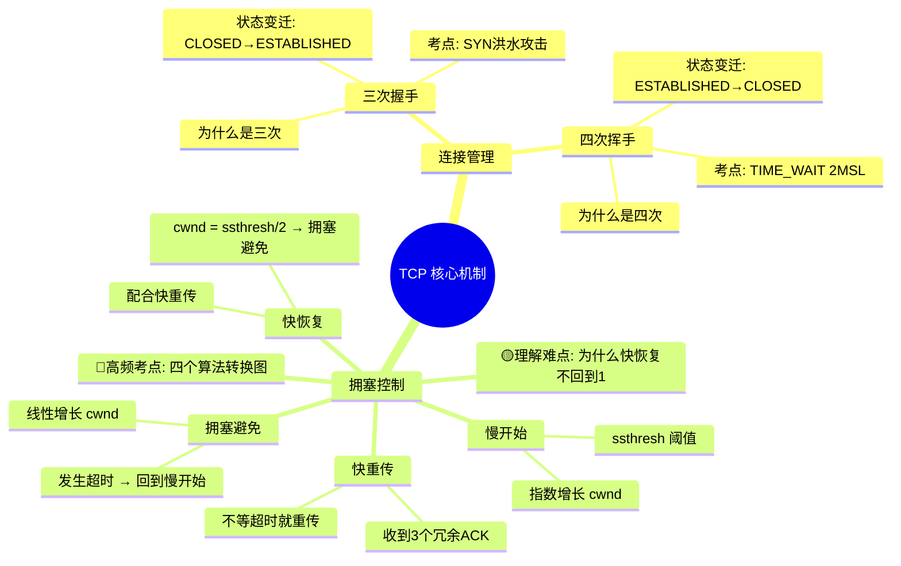

# 计算机网络 — TCP 连接管理与拥塞控制 知识复盘

## 思维导图



**导图使用建议**：从「三次握手」和「四次挥手」开始看，这是最基础的部分。然后看「拥塞控制」四个算法的转换关系——这是 408 大题常考的综合题型，需要理解每个算法在什么条件下触发、切换到哪个算法。

---

## 结构化笔记

### 一、TCP 连接管理：三次握手

#### 1.1 为什么是三次而不是两次或四次？

**一句话解释**：三次握手是为了**可靠地确认双方的发送和接收能力都正常**，同时**避免历史重复连接请求干扰新的连接**。

- **第一次握手**（客户端 → 服务端）：客户端发送 SYN。**服务端知道**：客户端的发送能力正常，自己的接收能力正常。**但客户端还不知道**自己的接收能力和服务端的发送能力是否正常。
- **第二次握手**（服务端 → 客户端）：服务端回复 SYN+ACK。**客户端知道**：自己的发送和接收能力都正常，服务端的发送和接收能力也正常。**但服务端还不知道**客户端的接收能力是否正常（万一 ACK 丢了）。
- **第三次握手**（客户端 → 服务端）：客户端发送 ACK。**服务端知道**：客户端的接收能力正常。至此双方都确认了对方没问题。

**为什么不是两次**？如果只有两次握手，服务端收到 SYN 就建立连接，那么一个**延迟的旧 SYN 报文**到达服务端时，服务端会误以为客户端要建立新连接，从而分配资源等待，造成资源浪费。三次握手时，客户端收到 SYN+ACK 后可判断是否是历史连接，若不是则发送 RST 复位。

**为什么不是四次**？三次已经能达成「双方确认对方能力」的目标，四次就冗余了。第三次握手其实可以携带数据，减少了开销。

**易错点**：
- 不要把「三次握手」和「三次数据传输」搞混——握手是建立连接的过程，不传数据（第三次可以带少量数据）。
- SYN 洪水攻击：客户端伪造大量 SYN 但不完成第三次握手，耗尽服务端资源。防范措施：SYN Cookie。

#### 1.2 状态变迁

```
CLOSED → SYN_SENT → ESTABLISHED（客户端）
CLOSED → LISTEN → SYN_RCVD → ESTABLISHED（服务端）
```

---

### 二、TCP 连接管理：四次挥手

**一句话解释**：四次挥手是因为 **TCP 是全双工通信**，每一方向的连接都需要单独关闭。

- **第一次挥手**（客户端 → 服务端）：客户端发送 FIN，表示「我发完了，不再发数据了」。此时客户端进入 FIN_WAIT_1 状态。
- **第二次挥手**（服务端 → 客户端）：服务端回复 ACK，表示「知道了你发完了」。但此时服务端**可能还有数据要发给客户端**，所以连接处于半关闭状态。客户端进入 FIN_WAIT_2，服务端进入 CLOSE_WAIT。
- **第三次挥手**（服务端 → 客户端）：服务端发送完剩余数据后，发送 FIN，表示「我也发完了，可以关了」。
- **第四次挥手**（客户端 → 服务端）：客户端回复 ACK，然后进入 TIME_WAIT 状态，等待 2MSL（最大报文段生存时间）后彻底关闭。

**为什么不是三次？**
- 因为第二次和第三次挥手之间可能隔了很长时间（服务端还有数据在发），不能合并。如果服务端收到 FIN 时也没有数据要发了，那第二次和第三次可以合并，变成三次挥手。
- **本质原因**：TCP 是全双工的，两个方向的关闭是独立的。客户端关了自己的发送通道，但服务端的发送通道可能还没关，所以需要单独发一次 FIN。

**易错点**：
- TIME_WAIT 为什么要等 2MSL？一是保证最后一个 ACK 能到达（万一丢了，服务端会重发 FIN），二是让过期报文在网络中消失，避免干扰新连接。
- 面试常问：大量 TIME_WAIT 连接怎么办？通常是服务端主动关闭导致，可以通过修改内核参数或开启 SO_REUSEADDR 解决。

**与已学知识的关联**：三次握手像是两个人打电话确认「你能听到我吗？」「能，你能听到我吗？」「能，我们开始聊吧」；四次挥手像是聊完后「我说完了」「收到，我还有一句……好了我也说完了」「收到，挂了」。

---

### 三、TCP 拥塞控制

**一句话解释**：拥塞控制是 TCP 为了避免**发送方发送太快导致网络中间设备（路由器）过载**而设计的一套动态调节机制。核心思路是「试探可用带宽，发现拥塞时退让」。

四个算法不是孤立的，而是一个**状态机转换**的关系。

#### 3.1 慢开始（Slow Start）

- **核心思想**：刚开始发送时不知道网络状况，从很小的拥塞窗口（cwnd，通常 1 个 MSS）开始，每收到一个 ACK 就翻倍。
- **增长方式**：**指数增长**。每轮 RTT，cwnd × 2。
- **目的**：快速探测到可用带宽的上限。
- **何时结束**：当 cwnd ≥ ssthresh（慢开始阈值）时，切换到**拥塞避免**；或发生超时重传时，回到慢开始。

#### 3.2 拥塞避免（Congestion Avoidance）

- **核心思想**：指数增长太快容易导致拥塞，改为**线性增长**，缓慢试探。
- **增长方式**：**加法增长**。每轮 RTT，cwnd += 1（或者说每收到一个 ACK，cwnd += 1/cwnd）。
- **何时结束**：发生**超时**时→回到慢开始，cwnd=1，ssthresh=cwnd/2；发生**三个冗余ACK**时→快重传+快恢复。

#### 3.3 快重传（Fast Retransmit）

- **核心思想**：不要等到超时才重传丢失的报文段，收到三个冗余 ACK 就立即重传。
- **冗余 ACK**：接收方收到乱序报文段时，会重复发送期望收到的序号对应的 ACK。连续收到 3 个相同的 ACK，说明该序号的数据包很可能丢失了。
- **优点**：比超时重传快得多，避免因等待超时而浪费吞吐量。

#### 3.4 快恢复（Fast Recovery）

- **核心思想**：配合快重传使用。收到三个冗余 ACK 不一定是严重拥塞（可能只是丢了一个包），所以**不必像超时那样回到起点**，而是适当降低发送速率并恢复。
- **动作**：ssthresh = cwnd / 2，cwnd = ssthresh（或 cwnd = ssthresh + 3），然后进入**拥塞避免**阶段。

#### 3.5 四个算法的整体转换关系

```
                             超时
慢开始 ──────────────────→ 慢开始（cwnd=1）
  │                            ↑
  │ cwnd ≥ ssthresh            │
  ↓                            │
拥塞避免 ────────────────→───┘
  │               超时
  │ 三个冗余 ACK
  ↓
快重传 + 快恢复
  │
  │ cwnd = ssthresh/2
  ↓
拥塞避免 ←───────────────┘
```

**关键记忆点**：

| 触发条件 | 动作 |
|---------|------|
| cwnd < ssthresh | 慢开始（指数增长） |
| cwnd ≥ ssthresh | 拥塞避免（线性增长） |
| 超时 | cwnd = 1，ssthresh = cwnd/2，重新慢开始 |
| 3个冗余ACK | 快重传 + 快恢复，cwnd = ssthresh，进入拥塞避免 |

**易错点**：
- 不要混淆「流量控制」和「拥塞控制」。流量控制是接收方控制发送方，通过 rwnd（接收窗口）；拥塞控制是网络状况控制发送方，通过 cwnd（拥塞窗口）。实际发送窗口 = min(rwnd, cwnd)。
- 快重传+快恢复是 TCP Reno 版本的算法。TCP Tahoe 版本在 3 冗余 ACK 时不走快恢复，而是直接回到慢开始（cwnd=1）。
- 408 大题常考：给一个场景（超时 vs 3 冗余 ACK），计算 cwnd 和 ssthresh 的新值。

---

## 费曼讲解

### 费曼讲解：为什么三次握手不是两次或四次？

> 想象你要跟一个朋友对讲机通话，但你俩的对讲机都是单向的，必须按下一个键才能说。在正式聊天前，你需要确认两边都能正常收发。
>
> 你说「喂，能听到吗？」（第一次握手）。朋友听到后说「能听到！你能听到我吗？」（第二次握手）。这时你确定了：自己能说、能听，朋友也能说、能听。但朋友还不知道你能不能听到他说的「能听到吗」。
>
> 所以你再说「我能听到你！」（第三次握手）。朋友就知道了你也能正常接收。三次通信后就双方都确认了，不需要第四次——因为第四次不会带来任何新信息。
>
> **一句话记忆点**：三次握手 = 双向确认「我能收发，你也能收发」，一次不多一次不少。

### 费曼讲解：为什么挥手要四次？

> 接续上面的对讲机例子。你们聊完了要挂断，但问题是两个方向的话是独立的。
>
> 你先说「我说完了」（第一次挥手，FIN）。朋友说「收到你说完了」（第二次挥手，ACK）。但这时朋友可能还有最后几句没说，所以你先别挂。
>
> 等朋友说完了，他说「我也说完了」（第三次挥手，FIN）。你回复「好的，收到，挂了」（第四次挥手，ACK）。
>
> 为什么不能三次？因为你不能把「收到你说完了」和「我也说完了」合并成一句话——你不知道朋友还要说多久。只有当他刚好也没话说了，这才能合并。
>
> **一句话记忆点**：四次挥手 = 全双工各关各的，各需要一对 FIN+ACK。

### 费曼讲解：拥塞控制四个算法之间的关系

> 想象你在一个陌生的城市开车去机场，不知道路上堵不堵。
>
> **慢开始**：你刚开始开得很慢，然后每确认一段路通畅就开快一点，再确认再加快（指数增长：1→2→4→8），快速试探这条路最高能开多快。
>
> **拥塞避免**：当你开到感觉快到上限了（cwnd ≥ ssthresh），就改为每次只稍微加一点速（线性增长：8→9→10→11），小心翼翼地试探，避免一下子撞上拥堵。
>
> **超时**：如果前面彻底堵死了（超时重传），你只能乖乖把速度降回 1，重新慢慢加速。
>
> **快重传 + 快恢复**：如果只是有个小坑颠了一下（丢了一个包，收到 3 个冗余 ACK），你不必把速度降回 1。你减到当前速度的一半，然后重新线性加速——这样既避免了拥堵，又不会因为反应过度而浪费已探明的路况。
>
> **一句话记忆点**：慢开始是快速试探，拥塞避免是谨慎猜测，超时回到起点，快重传和快恢复是「丢包不严重，降到一半继续」。

---

## 自测题目

### 基础回忆

**题目 1**：TCP 三次握手中，前两次握手分别让双方确认了什么信息？

<details>
<summary>点击查看答案</summary>

- 第一次握手（SYN）：服务端知道「客户端发送正常、自己接收正常」。
- 第二次握手（SYN+ACK）：客户端知道「自己发送和接收都正常、服务端发送和接收都正常」。

服务端还需要第三次握手才能确认客户端的接收能力正常。
</details>

---

**题目 2**：TCP 四次挥手中，TIME_WAIT 状态出现在哪一端？为什么要等待 2MSL？

<details>
<summary>点击查看答案</summary>

TIME_WAIT 出现在**主动关闭连接的一端**（通常是客户端）。等待 2MSL 的原因：
1. 保证最后一个 ACK 能可靠到达——如果丢失，服务端会重发 FIN，客户端需要重新发 ACK。
2. 让本连接中所有过期报文在网络中消失，避免干扰后续新的连接。
</details>

---

**题目 3**：拥塞控制中，ssthresh 是什么？慢开始阶段何时切换到拥塞避免阶段？

<details>
<summary>点击查看答案</summary>

ssthresh（Slow Start Threshold）是慢开始阈值，用于决定何时从指数增长切换到线性增长。当 cwnd ≥ ssthresh 时，从慢开始切换到拥塞避免。
</details>

---

### 理解辨析

**题目 4**：判断对错并说明理由：「TCP 握手必须是三次，挥手必须是四次，没有任何例外。」

<details>
<summary>点击查看答案</summary>

**错误**。

握手必须是三次没错（两次不可靠，四次冗余）。但挥手可以是三次——当服务端收到 FIN 时已经没有数据要发送了，可以将 ACK 和 FIN 合并发送，此时就是三次挥手。

更准确的说法：挥手至少需要三次，一般是四次。
</details>

---

**题目 5**：拥塞控制中的「快重传」和「超时重传」有什么区别？各自的触发条件是什么？

<details>
<summary>点击查看答案</summary>

- **超时重传**：发送方启动一个定时器，在 RTO（超时重传时间）内没有收到 ACK，就认为数据包丢失并重传。这是「被动等待」到超时，效率较低。
- **快重传**：发送方收到三个相同的冗余 ACK，即使定时器还没超时，也立即重传。这是「主动判断」丢包，效率更高。

快重传的前提是接收方启用了「延迟确认+累积确认」，乱序到达时会触发冗余 ACK。
</details>

---

**题目 6**：TCP 拥塞控制中，快恢复和慢开始的「慢」各自指什么？快恢复到底「恢复」了什么？

<details>
<summary>点击查看答案</summary>

- **慢开始的「慢」**：指刚开始发送时试探性地从很小的窗口（cwnd=1）开始，而不是直接全速发送。但它的增长方式实际上是指数的，非常快。
- **快恢复的「快」**：指检测到丢包后（3 冗余 ACK），不必像超时那样回到 cwnd=1 从头开始，而是直接从 ssthresh（cwnd/2）开始进入拥塞避免阶段，**快速恢复到接近原来的发送速率**。

「恢复」的是发送速率——它在「丢包但不严重」的场景下，保留了之前探明的可用带宽，不用归零重来。
</details>

---

### 综合应用

**题目 7**：假设 TCP 连接当前的拥塞窗口 cwnd = 8，ssthresh = 16。请问：
1. 当前处于什么阶段？
2. 收到一个 ACK 后 cwnd 变为多少？
3. 然后连续收到 3 个冗余 ACK，新 cwnd 和 ssthresh 分别是多少？

<details>
<summary>点击查看答案</summary>

1. 当前 cwnd=8 < ssthresh=16，处于**慢开始阶段**。
2. 慢开始阶段每收到一个 ACK，cwnd 翻倍（指数增长），所以 cwnd = 8 × 2 = 16。
3. 收到 3 个冗余 ACK，触发快重传+快恢复：
   - 新 ssthresh = cwnd / 2 = 16 / 2 = 8
   - 新 cwnd = 新 ssthresh = 8（TCP Reno）
   - 然后进入**拥塞避免**阶段（线性增长）
</details>

---

**题目 8**：场景题：某 TCP 连接使用 Reno 版本。发生超时时 cwnd=20，ssthresh=16。问超时后 cwnd 和 ssthresh 的新值，以及接下来处于什么阶段？

<details>
<summary>点击查看答案</summary>

发生超时后：
- 新 ssthresh = cwnd / 2 = 20 / 2 = 10
- 新 cwnd = 1
- 接下来处于**慢开始**阶段

然后 cwnd 会从 1 开始指数增长，直到 cwnd ≥ ssthresh (10) 时切换到拥塞避免。
</details>

---

### 关联思考

**题目 9**：TCP 拥塞控制的「加法增、乘法减」（AIMD）思想在操作系统的什么机制中也有体现？它们解决问题的本质有什么共同点？

<details>
<summary>点击查看答案</summary>

操作系统中**进程调度**的某些算法（如公平分享调度）也体现了 AIMD 思想。

共同点：都是**多个参与者共享有限资源时，通过试探-反馈-调整的闭环来达到公平和高效的平衡**。

- 网络：多个 TCP 连接共享链路带宽，通过拥塞控制来避免网络过载。
- 操作系统：多个进程共享 CPU/内存，通过调度和内存管理来避免系统过载。

本质都是**资源分配问题**——当需求超过供给时，需要一种分布式（或去中心化）的调节机制，让每个参与者自动退让，从而避免系统崩溃。
</details>

---

**题目 10**（进阶）：TCP 的「流量控制」和「拥塞控制」都涉及窗口限制。实际发送窗口 = min(rwnd, cwnd)。请说明：
1. rwnd 和 cwnd 分别由谁决定？
2. 为什么取最小值而不是求和？
3. 如果 rwnd 很小而 cwnd 很大，说明什么？

<details>
<summary>点击查看答案</summary>

1. rwnd（接收窗口）由**接收方**根据自身接收缓冲区大小决定，通过 TCP 报文头部的窗口字段告知发送方。cwnd（拥塞窗口）由**发送方**根据网络拥塞状况自行维护。
2. 取最小值而不是求和，因为两者代表的限制不同且**是「与」关系而非「或」关系**：
   - rwnd 限制：接收方处理不过来，你别再发了。
   - cwnd 限制：网络转发不过来，你别再发了。
   - 只要任何一个条件不满足，发送方就不能多发。取 min 意味着同时受限于两者。
3. 如果 rwnd 很小而 cwnd 很大，说明网络很通畅但接收方处理能力不足（比如接收方是性能较差的手机或服务器忙不过来）。这时瓶颈在接收方，而非网络。
</details>

---

## 复习建议

### 发现的薄弱环节（常见）

1. **状态机变迁图不够熟**：三次握手和四次挥手的状态转换（CLOSED, SYN_SENT, SYN_RCVD, FIN_WAIT_1, TIME_WAIT 等）是 408 选择题的高频考点，建议画出完整的状态图贴在书桌旁。
2. **拥塞控制版本混淆**：注意区分 TCP Tahoe（3 冗余 ACK 直接慢开始）和 TCP Reno（3 冗余 ACK 走快恢复），408 大题默认考 Reno，但需要看清题目说的是哪个版本。
3. **「拥塞避免」的字面误解**：涌塞避免的名字容易让人以为是在「避免拥塞」，其实它是在拥塞发生后（或接近拥塞阈值时）的**缓慢增长**策略，并不是真的能避免拥塞。

### 下一步建议

1. **手绘状态变迁图**：分别画出三次握手和四次挥手的完整 TCP 状态变迁图（客户端和服务端分开画），确保每个状态转换的条件和方向都标注清楚。
2. **做计算题专项训练**：找 3-5 道 408 真题，专门练习「给定初始 cwnd 和 ssthresh，按时间序列画 cwnd 变化曲线」——这是 408 网络的经典大题题型。
3. **交叉关联**：将 TCP 拥塞控制与操作系统的**进程调度公平性**、计算机组成原理的**Cache 替换策略**关联思考——408 大题经常跨科目综合出题。
4. **对比强化**：整理一个对比表放在笔记前面：

| 概念 | 控制对象 | 触发方 | 限制方式 |
|------|---------|--------|---------|
| 流量控制 | 发送方与接收方之间 | 接收方 | 通过 rwnd 限制 |
| 拥塞控制 | 发送方与网络之间 | 发送方 | 通过 cwnd 限制 |
| 三次握手 | 连接建立 | 双方 | SYN/ACK 确认 |
| 四次挥手 | 连接释放 | 双方 | FIN/ACK 确认 |

### 推荐资源

- **书籍**：谢希仁《计算机网络》第 7/8 版——408 指定教材，TCP 部分讲得最扎实。
- **视频**：B 站「计算机网络微课堂」——用动画演示握手挥手和拥塞控制过程，特别适合视觉记忆。
- **工具**：Wireshark 抓包看真实 TCP 三次握手和四次挥手——理解理论后抓一次包看看真实报文，能彻底记住。

---

> **记住**：学习是渐进的过程。今天先掌握三次握手和四次挥手为什么是三次和四次，再搞清楚拥塞控制的四个算法的转换关系，下次看到它们就不会再混淆了。每次复盘都有价值！
