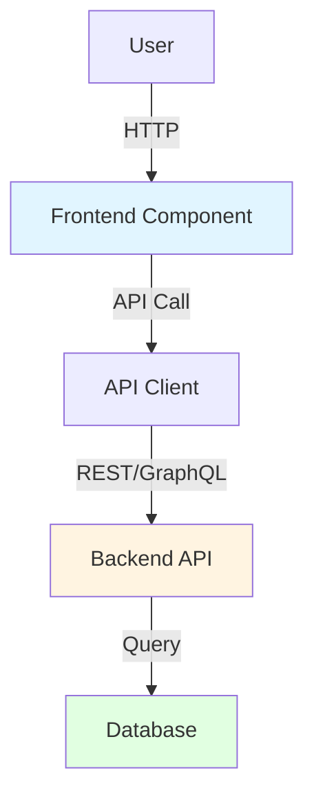
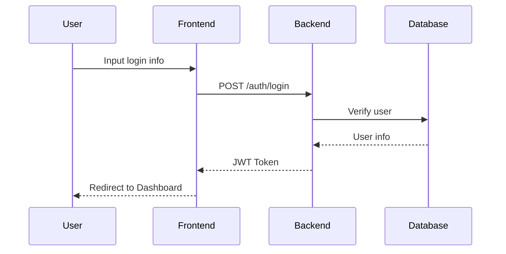
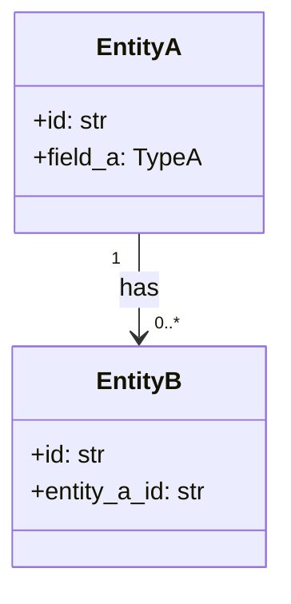

# {System Name} System Design Document (L0 — Navigation Layer)

| Field          | Value                                                                    |
| ------------- | ------------------------------------------------------------------------ |
| **System ID** | `{system-id}`                                                            |
| **Project**   | {Project Name}                                                           |
| **Version**   | 1.0                                                                      |
| **Status**    | `Draft` / `Review` / `Approved`                                          |
| **Author**    | {Author Name or Agent}                                                   |
| **Date**      | {YYYY-MM-DD}                                                              |
| **L1 Detail** | [{system-id}.detail.md](./{system-id}.detail.md) — Load only during `/forge` |

> [!IMPORTANT]
> **Document Layering Explanation**
> - **This file (L0 Navigation Layer)**: Architecture diagrams, operation contracts, design decisions. For quick understanding and task planning. Prohibited from placing config dictionaries, algorithm pseudocode and method bodies.
> - **[{system-id}.detail.md](./{system-id}.detail.md) (L1 Implementation Layer)**: Complete pseudocode, config constants, edge cases. Load only when explicitly referenced by `/forge` tasks.
> - **L1 Anchor Principle **: Every section in L1 must have a corresponding hyperlink entry in this file. Strictly prohibited from having "orphaned content" in L1 that is completely unmentioned in L0.

---

## Table of Contents

|   §   | Chapter                                                         | Key Content                                                    |
| :---: | --------------------------------------------------------------- | -------------------------------------------------------------- |
|   1   | [Overview](#1-overview)                                        | System purpose, boundaries, responsibilities                   |
|   2   | [Goals & Non-Goals](#2-goals--non-goals)                        | Goals / Non-Goals                                             |
|   3   | [Background & Context](#3-background--context)                  | Why this system is needed, constraints                        |
|   4   | [Architecture](#4-architecture)                                 | Mermaid architecture diagram, component responsibilities, data flow |
|   5   | [Interface Design](#5-interface-design)                         | Operation contract table, cross-system protocols, HTTP API    |
|   6   | [Data Model](#6-data-model)                                     | Entity field declarations, ER diagram → [L1 §1-2](./{system-id}.detail.md) |
|   7   | [Technology Stack](#7-technology-stack)                          | Core technologies, key dependencies                            |
|   8   | [Trade-offs](#8-trade-offs--alternatives)                      | Decision rationale, alternative comparison                     |
|   9   | [Security](#9-security-considerations)                          | Authentication authorization, risks and mitigation             |
|  10   | [Performance](#10-performance-considerations)                    | Performance goals, optimization strategies                    |
|  11   | [Testing](#11-testing-strategy)                                 | Unit tests, integration, performance tests                    |
|  12   | [Deployment](#12-deployment--operations) *(optional)*            | Process, monitoring, observability                            |
|  13   | [Future](#13-future-considerations) *(optional)*                 | Extensibility, technical debt                                |
|  14   | [Appendix](#14-appendix) *(optional)*                           | Glossary, references, change log                              |

**L1 Implementation Layer** → [{system-id}.detail.md](./{system-id}.detail.md) (Load only during `/forge`)
> [§1 Config Constants](./{system-id}.detail.md) · [§2 Data Structures](./{system-id}.detail.md) · [§3 Algorithms](./{system-id}.detail.md) · [§4 Decision Trees](./{system-id}.detail.md) · [§5 Edge Cases](./{system-id}.detail.md)

---

## 1. Overview

### 1.1 System Purpose
[What problem does this system solve? Why is it needed?]

### 1.2 System Boundary
<!--  CRITICAL: Clearly define boundaries to avoid unclear responsibilities -->

- **Input**: [What does the system receive? From where?]
- **Output**: [What does the system produce? For whom?]
- **Dependencies**: [Which other systems does it depend on?]
- **Dependents**: [Which systems depend on this system?]

### 1.3 System Responsibilities
<!-- Clearly define "what is responsible for" and "what is not responsible for" -->

**Responsible for**:
- [Responsibility 1]
- [Responsibility 2]

**Not responsible for**:
- [Non-responsibility 1 - handled by XX system]
- [Non-responsibility 2 - out of scope]

---

## 2. Goals & Non-Goals

### 2.1 Goals
<!-- Inherit requirements from PRD, convert to technical goals for this system -->

- **[G1]**: [Specific goal for this system, e.g., API response time p95 < 200ms]
- **[G2]**: [Measurable performance/quality goal]

### 2.2 Non-Goals
- **[NG1]**: [Content not within this system's scope]

---

## 3. Background & Context

### 3.1 Why This System?
[Problem background, business drivers, related PRD requirements]

**Related PRD Requirements**: [REQ-001], [REQ-002], ...

### 3.2 Current State
[How is it currently done? What are the problems?]

### 3.3 Constraints
<!-- Inherit from Constraint Analysis in PRD -->

- **Technical constraints**: [Must use or avoid certain technologies, e.g., must be compatible with existing Python 3.9 environment]
- **Performance constraints**: [Performance requirements, e.g., 1000 concurrent req/s]
- **Resource constraints**: [Team, time, budget]
- **Security constraints**: [Security requirements, e.g., all data must be encrypted in transit]

---

## 4. Architecture

### 4.1 Architecture Diagram
<!--  CRITICAL: Use Mermaid or image to display system architecture -->



### 4.2 Core Components
<!-- Responsibilities and tech stack for each component -->

| Component Name | Responsibility | Tech Stack | Notes  |
| -------------- | -------------- | ---------- | ------ |
| [Component 1]  | [Responsibility description]     | [Technology]     | [Notes] |
| [Component 2]  | [Responsibility description]     | [Technology]     | [Notes] |

### 4.3 Data Flow
<!-- Describe how data flows between components -->



**Key data flow description**:
1. [Flow 1 description]
2. [Flow 2 description]

---

## 5. Interface Design

<!--  L0 writing principles:
  - Backend API: Only place endpoint paths + request/response structure summary (no need for complete JSON examples)
  - Agent/Game systems: Use "operation contract table" instead of function pseudocode
  - Complete parameter details, error code lists → {system}.detail.md §3
-->

### 5.1 Operation Contracts

<!--  Core format: Use table instead of function pseudocode. Each row covers one atomic operation. -->
<!-- "detail link" fills in the corresponding § section number of {system}.detail.md -->

| Operation                 | [REQ-XXX] | Preconditions     | Cost/Input | Output/Side Effects  |      Implementation Detail       |
| ------------------------ | :-------: | ----------------- | ---------- | -------------------- | :-------------------------------: |
| `operation_a(param)`     | [REQ-001] | Condition 1; Condition 2 | cost     | State change description | [§3.1](./detail.md) |
| `operation_b(param)`     | [REQ-002] | Condition 1        | cost     | State change description | [§3.2](./detail.md) |

> **Fill instructions**:
> - **Operation**: Use function signature style `func_name(key_params)`, parameters only write key input types, no type annotations
> - **Preconditions**: Concise list, separated by `;`, no more than 3
> - **Output/Side Effects**: Describe state changes, e.g., "Generate Boat, carry unit; original unit disappears"
> - **Implementation Detail**: Link to corresponding chapter in `.detail.md` (if not yet created, fill "to be added")

### 5.2 Cross-System Interface Protocols

<!-- Boundary protocols with other systems: Protocol / ABC interface signatures, without method bodies -->

```python
# Example: Interface protocol exposed by this system for other systems to call (Protocol/ABC)
class ISystemName(Protocol):
    def method_a(self, param: Type) -> ReturnType: ...
    def method_b(self, param: Type) -> ReturnType: ...
```

### 5.3 HTTP API Endpoint Summary (if applicable)

<!-- Only required for backend service systems, Agent/game core systems skip this -->
<!-- Only list endpoint list, no complete JSON examples (JSON examples → detail.md) -->

| Method | Path          | Auth  | Purpose               | [REQ-XXX] |
| ------ | ------------- | :---: | --------------------- | :-------: |
| POST   | `/auth/login` |  No   | User login, return JWT | [REQ-001] |
| GET    | `/users/me`   |  JWT  | Get current user info   | [REQ-002] |

---

## 6. Data Model

<!--  L0 writing principles — strictly follow:
   Allowed: @dataclass attribute field declarations
   Allowed: Protocol style method signatures (def foo(self, x: T) -> R: ...)
   Prohibited: Any method bodies (even if only 2 lines)
   Prohibited: Comment-style method lists (# def foo... this kind)
   Prohibited: Config constant dictionaries (UNIT_CONFIG = {...})
  → Above content all goes into {system}.detail.md §1 and §2. And based on "L1 anchor principle", you must use Markdown hyperlinks here to indicate where they are in L1, for example:
  *(Complete config constant dictionary see [{system}.detail.md §1](./{system}.detail.md))*
-->

### 6.1 Core Entities

```python
# ── Only attribute fields + method signatures, method bodies prohibited ──
@dataclass
class EntityName:
    id: str
    field_a: TypeA
    field_b: TypeB = default_value

    def some_method(self, param: Type) -> ReturnType: ...
    def another_method(self) -> bool: ...
```

> *(Complete method implementation → [L1 §2](./{system-id}.detail.md) · Config constant dictionary → [L1 §1](./{system-id}.detail.md))*

### 6.2 Entity Relationship Diagram



### 6.3 Data Flow Direction
[How does data flow between systems? Where is it stored?]

---

## 7. Technology Stack

### 7.1 Core Technologies
<!-- Inherit from ADR, or add new system-level tech decisions -->

| Domain    | Choice     | Rationale                              |
| --------- | ---------- | -------------------------------------- |
| Framework | FastAPI    | High performance, async, type safe, auto OpenAPI generation |
| Database  | PostgreSQL | ACID, JSON support, mature ecosystem, team familiar |
| Cache     | Redis      | High performance, rich data structures, persistence options |
| ORM       | SQLAlchemy | Type safe, flexible, async support     |

### 7.2 Key Libraries/Dependencies
- `pydantic ^2.0`: Data validation, serialization
- `jose`: JWT token generation and verification
- `passlib[bcrypt]`: Password hashing
- `asyncpg`: PostgreSQL async driver

---

## 8. Trade-offs & Alternatives
<!--  CRITICAL: Google Design Docs style - explain why choose A not B -->

> [!IMPORTANT]
> **ADR Reference Rule (unidirectional reference chain)**
>
> **Why**: Decisions recorded once, other places only reference not copy. This way when modifying ADR, all SYSTEM_DESIGN automatically associate through reference, won't miss.
>
> **Rules**:
> - If decision already recorded in ADR, **only reference not copy**
> - Reference format: `> **Decision source**: [ADR-XXX: Decision title](../03_ADR/ADR_XXX.md)`
> - Only decisions specific to this system are detailed here
>
> **Self-check example**:
>
>  **Wrong** - Copy ADR content:
> ```markdown
> ### 8.1 Database selection
> We choose PostgreSQL because:
> - ACID guarantee
> - JSON support
> - Team familiar
> (These reasons already recorded in ADR-001, should not copy)
> ```
>
>  **Correct** - Reference ADR:
> ```markdown
> ### 8.1 Database selection
> > **Decision source**: [ADR-001: Tech Stack Selection](../03_ADR/ADR_001_TECH_STACK.md)
> >
> > This system uses PostgreSQL defined in ADR-001.
> >
> > **System-specific config**: Connection pool size 20, use asyncpg async driver
> ```

### 8.1 [Cross-system Decision] - Reference ADR

<!-- If this decision affects multiple systems, should be recorded in ADR -->

> **Decision source**: [ADR-XXX: Decision title](../03_ADR/ADR_XXX.md)
>
> This system implements design defined in ADR-XXX, decision rationale not repeated here.
>
> **System-specific implementation**: [Supplement how this system implements that decision]

---

### 8.2 [System-specific Decision] - Detailed Explanation

<!-- If this decision only affects this system, detail here -->

**Option A: [Name] ( Selected)**
- **Pros**: 
  - ...
- **Cons**:
  - ...

**Option B: [Name]**
- **Pros**:
  - ...
- **Cons**:
  - ...

**Decision**: Choose [Option A], because [core reason].

---

<!-- Example: Decision referencing ADR -->
### 8.x Example: Database Selection (Reference ADR)

> **Decision source**: [ADR-001: Tech Stack Selection](../03_ADR/ADR_001_TECH_STACK.md)
>
> This system uses PostgreSQL defined in ADR-001 as primary database.
>
> **System-specific config**:
> - Connection pool size: 20
> - Use asyncpg async driver

---

<!-- Example: System-specific decision -->
### 8.y Example: Caching Strategy (System Decision)

**Option A: Redis ( Selected)**
- High performance, team familiar
- Requires additional ops

**Option B: In-memory cache**
- Simple
- Does not support distributed

**Decision**: Choose Redis, because this system needs to support multi-instance deployment.

## 9. Security Considerations

### 9.1 Authentication & Authorization
- **Authentication**: JWT + bcrypt password hashing (rounds=10)
- **Authorization**: RBAC (Role-Based Access Control)

### 9.2 Data Encryption
- **In Transit**: HTTPS/TLS 1.3, disable TLS 1.0/1.1
- **At Rest**: Sensitive field encryption (e.g., password hash, payment info)

### 9.3 Security Risks & Mitigations

| Risk         | Severity | Mitigation                              |
| ------------ | :------: | --------------------------------------- |
| SQL injection    |    High   | Use ORM parameterized queries, prohibit SQL concatenation |
| XSS          |    Medium | Input validation, output escaping, CSP header |
| CSRF         |    Medium | CSRF Token (if applicable)             |
| Password brute force |    High   | Rate limiting (5 times/minute/IP)       |
| JWT forgery  |    High   | Use strong key (HS256, 256-bit), regular rotation |

---

## 10. Performance Considerations

### 10.1 Performance Goals
<!-- Inherit from Constraints in PRD -->

- **API response time**: p95 < 200ms, p99 < 500ms
- **Concurrency support**: 1000 req/s
- **Database query**: < 50ms (p95)
- **Cache hit rate**: > 80% (hot data)

### 10.2 Optimization Strategies

1. **Caching**:
   - Redis cache user info, permission config
   - TTL: 5 minutes (user info), 10 minutes (config)
   - Cache invalidation strategy: Write-through

2. **Database Optimization**:
   - Build indexes for high-frequency query fields (`email`, `created_at`)
   - Connection pool size: 20 (adjust based on concurrency)
   - Use `EXPLAIN ANALYZE` to analyze slow queries

3. **Async I/O**:
   - FastAPI async endpoints
   - asyncpg async database driver
   - Redis async client (aioredis)

### 10.3 Performance Monitoring

- **Tools**: Prometheus + Grafana
- **Key metrics**:
  - Latency (p50, p95, p99)
  - Throughput (req/s)
  - Error Rate (%)
  - Cache Hit Rate (%)

---

## 11. Testing Strategy

### 11.1 Unit Testing
- **Coverage Target**: > 80%
- **Framework**: pytest + pytest-asyncio
- **Key Test Areas**:
  - [ ] User authentication logic (password verification, JWT generation)
  - [ ] Data validation (Pydantic models)
  - [ ] Business logic (user CRUD)

### 11.2 Integration Testing
- **Tool**: pytest + TestClient (FastAPI)
- **Test Scenarios**:
  - [ ] End-to-end login flow (POST /auth/login → verify → return Token)
  - [ ] Database transaction (create user → Rollback on error)
  - [ ] Redis cache interaction

### 11.3 End-to-End Testing - Optional
- **Tool**: Playwright / Cypress (if frontend system)
- **Test Scenarios**:
  - [ ] User login complete flow (frontend → backend → database)

### 11.4 Performance Testing
- **Tool**: Locust / k6
- **Scenarios**:
  - [ ] 1000 concurrent user login
  - [ ] Target: p95 < 200ms

### 11.5 Contract Verification Matrix

| Contract | Risk Level | Normal State Verification | Failure State Verification | Regression Responsibility |
|----------|------------|-------------------------|---------------------------|-------------------------|
| `POST /auth/login` | Critical path | Integration test | Invalid credential returns 401 | Authentication main chain minimal regression |
| JWT generation rule | Base rule layer | Unit test | Invalid input/expiry boundary | Token related regression |

> **Requirements**:
> - Each key public contract should have one verification responsibility
> - Failure state / boundary state should not be omitted
> - Blueprint and Challenge should prioritize reusing this matrix, not completely rely on subsequent inference

---

## 12. Deployment & Operations

### 12.1 Deployment Process

1. **Build**: `docker build -t backend-api:v1.0 .`
2. **Push**: `docker push registry.example.com/backend-api:v1.0`
3. **Deploy**: Kubernetes deployment
   ```yaml
   apiVersion: apps/v1
   kind: Deployment
   metadata:
     name: backend-api
   spec:
     replicas: 3
     selector:
       matchLabels:
         app: backend-api
     template:
       spec:
         containers:
         - name: api
           image: registry.example.com/backend-api:v1.0
           resources:
             requests:
               cpu: "500m"
               memory: "512Mi"
             limits:
               cpu: "1000m"
               memory: "1Gi"
   ```

### 12.2 Monitoring & Alerting

**Logging**:
- **Format**: Structured JSON logging
- **Destination**: stdout → Fluentd → Elasticsearch
- **Log Levels**: INFO (production), DEBUG (development)
- **Prohibited from recording**: Passwords, Tokens, PII

**Metrics**:
- **Tool**: Prometheus → Grafana
- **Key Metrics**: Latency, Throughput, Error Rate, Cache Hit Rate

**Alerting**:
- API error rate > 5% → Slack notification
- p95 response time > 500ms → Email notification
- Service Down → PagerDuty

### 12.3 Observability

- **Tracing**: Jaeger / OpenTelemetry (optional)
- **Health Check**: `/health` endpoint
  ```json
  {
    "status": "healthy",
    "database": "connected",
    "redis": "connected",
    "version": "1.0.0"
  }
  ```

---

## 13. Future Considerations

### 13.1 Scalability
- **Horizontal Scaling**: Kubernetes HPA (Horizontal Pod Autoscaler)
  - Target: CPU > 70% → Scale up
- **Database Scaling**: Read-write separation + sharding (when user count > 1 million)

### 13.2 Tech Debt
- [ ] Migrate to microservices architecture (when API endpoints > 50)
- [ ] Introduce GraphQL (when frontend needs flexible queries)
- [ ] Database sharding strategy design

### 13.3 Future Enhancements
- [ ] Implement OAuth2.0 for third-party login [REQ-XXX future]
- [ ] Add multi-factor authentication (MFA) [REQ-XXX future]
- [ ] User behavior analytics (Analytics)

---

## 14. Appendix

### 14.1 Glossary
- **JWT (JSON Web Token)**: A stateless authentication method
- **RBAC (Role-Based Access Control)**: Role-based access control
- **p95**: 95th percentile, 95% of request response times are less than this value

### 14.2 Optional Skills & Reference Resources
>
> This section is used to record skills, component libraries, methodologies, or external materials actually referenced during the design process.
> These contents are auxiliary inputs, not system fact sources; final solution still based on this project's PRD, ADR, Architecture Overview and this document itself.
>
> **Recording suggestions**:
> - Write resource name
> - Write which design decision it helped
> - Write what was finally adopted, what was discarded
>
> **Example (frontend system)**:
> - `vercel-react-best-practices`: Used to verify React component boundaries, rendering strategy, performance optimization suggestions
> - `frontend-design`: Used to reference layout, color scheme, hierarchy and animation direction
> - `shadcn/ui`: Used for basic component pattern reference
> - `Aceternity UI`: Used for display blocks and interactive animation inspiration
> - `Magic UI`: Used for Tailwind-first visual and animation reference

### 14.3 References
- [FastAPI Documentation](https://fastapi.tiangolo.com/)
- [PostgreSQL Best Practices](https://wiki.postgresql.org/wiki/Don%27t_Do_This)
- [JWT Best Practices](https://tools.ietf.org/html/rfc8725)
- [Architecture Overview](../02_ARCHITECTURE_OVERVIEW.md)
- [ADR001: Tech Stack](../03_ADR/ADR001_TECH_STACK.md)

### 14.4 Change Log

| Version | Date       | Changes  | Author |
| ------- | ---------- | -------- | ------ |
| 1.0     | 2026-01-08 | Initial version | XXX    |

---

<!--  AGENT Usage Guide

L0 writing nine principles:
1. Navigation layer positioning — Do not show implementation details, for quick understanding and task planning
2. TOC synchronization — New chapters must synchronously update file header directory table
3. Operation contract table — §5.1 one atomic operation per row, "implementation detail" column must link to L1
4. Attribute declarations — §6 only place fields + method signatures (def foo(): ...), method bodies prohibited
5. L1 anchors — Any content extracted to L1 must leave hyperlink at corresponding position in L0, prohibited from orphan islands
6. Traceability chain — [REQ-XXX] reference PRD, do not copy original text
7. Constraint inheritance — Inherit from PRD / ADR, cannot relax
8. Trade-offs — Each selection explains "reason for choosing A not B"
9. Mermaid priority — Architecture diagrams / data flow / decision trees, use diagrams not text lists

L1 split rules (trigger any one to create .detail.md):
  R1 Single code block > 30 lines
  R2 Total code block lines > 200 lines
  R3 Config constant dictionary entries > 5
  R4 Version inline comments > 5 places
  R5 Total document lines > 500 lines

Mandatory chapters: 1-11  |  Optional chapters: 12 (deployment) · 13 (future) · 14 (appendix)
-->
